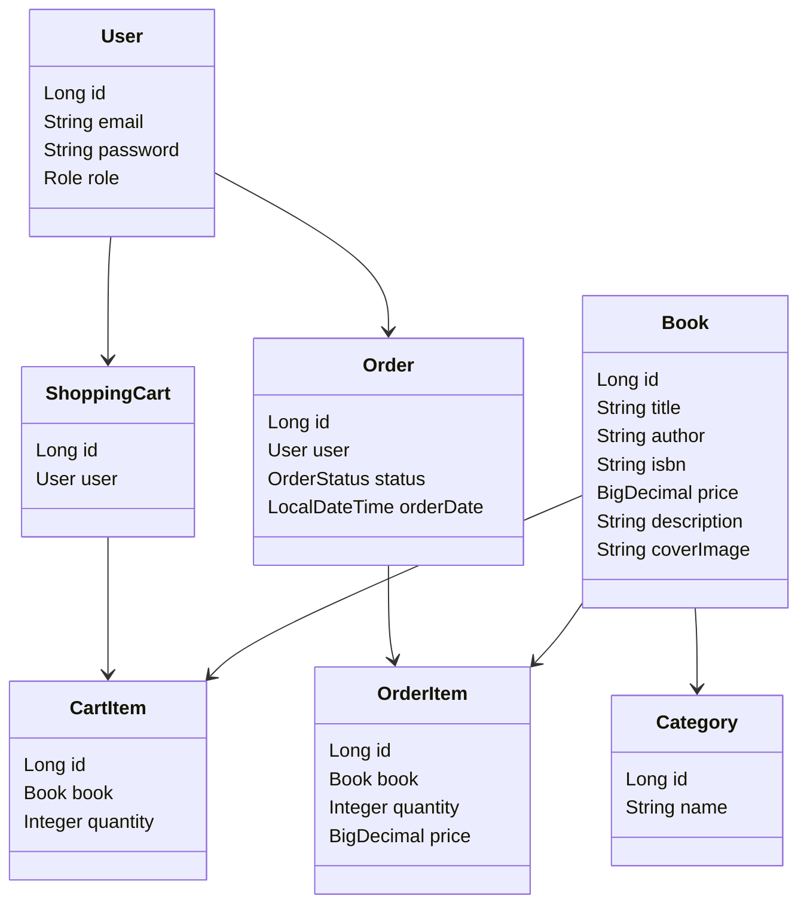

# Bookstore API

**A Full-Featured RESTful Backend for an Online Bookstore**
*Built with Spring Boot, Spring Security & MySQL*


---

## Inspiration & Purpose

> **"Why build another bookstore?"**
> Because every great developer needs a **real-world project** that ties together **authentication, CRUD, relationships, security, and testing** — all in one clean, scalable system.

This **Bookstore API** simulates a **fully functional e-commerce backend**, empowering users to:

* Browse & search books by title/author
* Register/login with **JWT-based authentication**
* Add books to a **persistent shopping cart**
* Place **orders** and track status
* Admins manage inventory & order fulfillment

Perfect for **job applications**, **technical interviews**, and **portfolio building**.

---

## Tech Stack & Tools

| Layer          | Technology                            |
| -------------- | ------------------------------------- |
| **Language**   | Java 17                               |
| **Framework**  | Spring Boot 3.2                       |
| **Security**   | Spring Security + JWT                 |
| **Database**   | MySQL + Testcontainers                |
| **ORM**        | Spring Data JPA / Hibernate           |
| **Validation** | Bean Validation (Hibernate Validator) |
| **Testing**    | JUnit 5, Mockito, Testcontainers      |
| **API Docs**   | Springdoc OpenAPI (Swagger UI)        |
| **Build Tool** | Maven                                 |
| **Utilities**  | Lombok, MapStruct                     |

---

## Key Features

* **User Authentication** – Register & login with JWT
* **Role-Based Access** – `USER` & `ADMIN` roles
* **Shopping Cart** – Add, update, remove items
* **Order Management** – Place orders, view history
* **Book Search** – Filter by title, author, category
* **Category System** – Many-to-many book categorization
* **Soft Delete** – Logical deletion for data integrity
* **Pagination & Sorting** – Efficient data retrieval

---

## How to Launch the Project

### **1. Clone the Repository**

```bash
git clone https://github.com/aniliashenko/bookstore-api.git
cd bookstore-api
```

### **2. Configure MySQL**

Create a database:

```sql
CREATE DATABASE bookstore;
```

Configure `application.properties`:

```properties
spring.datasource.url=jdbc:mysql://localhost:3306/bookstore
spring.datasource.username=root
spring.datasource.password=your_password
spring.jpa.hibernate.ddl-auto=validate
spring.liquibase.enabled=true
```

### **3. Run with Maven**

```bash
mvn spring-boot:run
```

### **4. Access the API Documentation**

Swagger UI:

```
http://localhost:8080/swagger-ui.html
```

OpenAPI JSON:

```
http://localhost:8080/v3/api-docs
```

---

## Model Diagram

```
User (1) -------- (1) ShoppingCart (1) -------- (M) CartItem (M) -------- (1) Book

User (1) -------- (M) Order (1) -------- (M) OrderItem (M) -------- (1) Book

Book (M) -------- (M) Category
```

### **ERD**

```
+----------+        +---------------+        +-------------+
|  users   | 1    1 | shopping_cart | 1    M | cart_items  |
+----------+        +---------------+        +-------------+
| id       |        | id            |        | id          |
| email    |        | user_id (FK)  |        | cart_id (FK)|
| password |        +---------------+        | book_id (FK)|
+----------+                                 | quantity    |
                                              +-------------+

+----------+       +-------------+       +----------------+
|  books   | 1   M | order_items | M   1 |   orders       |
+----------+       +-------------+       +----------------+
| id       |       | id          |       | id             |
| title    |       | book_id     |       | user_id (FK)   |
| author   |       | order_id    |       | status         |
+----------+       | quantity    |       | total          |
                   +-------------+       +----------------+

books (M) --- (M) categories
```

---

## Postman Collection

A ready-to-import Postman collection is available:
**`postman/Bookstore-API.postman_collection.json`** (place file in repo)

Import it into Postman:
**Postman → Import → File → Select collection**

Included:

* Auth register/login
* CRUD for books/categories
* Cart operations
* Order workflow

---

## API Endpoints

### Public

* `POST /auth/registration` – Create account
* `POST /auth/login` – Get JWT token
* `GET /books` – Browse books
* `GET /categories` – View categories

### User

* `GET /cart` – View cart
* `POST /cart` – Add item
* `PUT /cart/cart-items/{id}` – Update quantity
* `DELETE /cart/cart-items/{id}` – Remove item
* `POST /orders` – Checkout
* `GET /orders` – User orders

### Admin

* `POST /books` – Add book
* `PUT /books/{id}` – Update book
* `PATCH /orders/{id}/status` – Update status

---

## Author

**Anton Iliashenko**
*Java Backend Developer | Spring Boot | Clean Architecture*

[GitHub](https://github.com/aniliashenko)
[LinkedIn](https://www.linkedin.com/in/anton-iliashenko-09495430a/)
[windsweptofficial@gmail.com](mailto:windsweptofficial@gmail.com)

---

## 🚀 How to Launch the Project

### **1. Clone the repository**

```bash
git clone https://github.com/aniliashenko/bookstore-api.git
cd bookstore-api
```

### **2. Configure MySQL**

Create a database:

```sql
CREATE DATABASE bookstore;
```

Update `application.properties` or `application.yml`:

```properties
spring.datasource.url=jdbc:mysql://localhost:3306/bookstore
spring.datasource.username=root
spring.datasource.password=your_password
```

### **3. Run the project**

Using Maven:

```bash
mvn clean install
mvn spring-boot:run
```

Or in IDE:
**Run → BookstoreApiApplication**

### **4. Swagger Documentation**

After launch:
👉 **[http://localhost:8080/swagger-ui/index.html](http://localhost:8080/swagger-ui/index.html)**
👉 **[http://localhost:8080/v3/api-docs](http://localhost:8080/v3/api-docs)**

---

## 🧩 Model Diagram



---

## 📦 Postman Collection

A ready-to-use Postman Collection is included in the project:
**`postman/Bookstore API.postman_collection.json`**

If not present in your repo, add it here:

```
postman/
 └── bookstore-api.postman_collection.json
```

Import it into Postman:
**Postman → Import → Select File**

---
